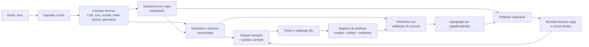

# Arquitetura de ML — CS2 Detector de Suspeitos

Este documento define a estrutura proposta para evoluir o detector forense de
demos para um sistema híbrido de regras explicáveis + aprendizado de máquina
(ML não generativo). É um plano arquitetural: não altera o detector atual nem
autoriza que um modelo acuse jogadores automaticamente.

## Princípio do produto

O projeto continuará sendo um analisador local de demos, voltado a priorizar
lances para revisão humana. O modelo deve responder à pergunta:

> Qual a prioridade de revisar este lance, dado o comportamento observado e a
> informação legítima disponível?

Ele **não** deve responder "este jogador é cheater". Nenhum score de ML é
prova, gatilho de denúncia automática ou substituto do `demo_gototick`.

### Alvo inicial e não-objetivos

O primeiro modelo terá um alvo único e auditável: **priorizar episódios com
evidência de ESP observável não explicada pelo contexto disponível na demo**.
Ele não tentará, inicialmente, classificar todos os tipos de cheat, prever ban
ou estimar a "chance real de cheat" de uma pessoa.

O produto inicial é voltado a ESP/wallhack sem assistência de mira. Aim assist,
spinbot e outros comportamentos devem ser mantidos como estratos de análise ou
tarefas futuras separadas; não podem entrar silenciosamente como positivos do
mesmo classificador de ESP.

## O que significa "IA" neste projeto

A IA proposta é um modelo de **aprendizado de máquina preditivo, não
generativo**. Ela não conversa, não escreve relatórios por conta própria e não
substitui o parser da demo. Ela recebe features numéricas já extraídas pelo
Python e estima a prioridade de revisão de cada lance e jogador.

O paralelo com um recomendador como o do iFood é útil:

| Recomendador | CS2 Detector |
|---|---|
| Contexto do usuário, horário e itens | Contexto da demo, mira, visibilidade e decisões |
| Resultado histórico: clique/pedido | Resultado histórico: revisão humana/validação posterior |
| Prevê interesse e ordena itens | Prevê prioridade de revisão e ordena evidências |
| Feedback melhora versões futuras | Revisões melhoram versões futuras |

O Python atual continuará sendo o motor de ingestão e de evidência. Durante a
análise de uma demo, ele extrai os fatos e entrega as features a um modelo
versionado que roda localmente; o modelo devolve um ranking para o relatório.
Probabilidade só pode ser exibida depois de calibração comprovada em dados
independentes. O modelo não precisa de nuvem nem de monitoramento em tempo
real.

### Treino, inferência e melhoria controlada

- **Inferência:** a cada demo analisada, o modelo já treinado avalia novos
  lances. Receber dados novos não significa que ele aprendeu com eles.
- **Coleta de feedback:** revisões humanas, casos ambíguos e validações
  posteriores alimentam o dataset rotulado.
- **Treino:** periodicamente, uma nova versão é treinada com o dataset
  congelado e comparada à versão atual.
- **Publicação:** só uma versão que melhora métricas e revisão humana em casos
  nunca vistos substitui a anterior; deve existir rollback.

Portanto, o projeto melhora com feedback, mas não se autoaltera a partir de
qualquer demo, ban ou resultado. Esse controle é necessário para evitar vieses
e falsos positivos.

## Arquitetura-alvo



O detector atual permanece como a fonte de fatos observáveis: eventos, ticks,
mira, visibilidade, geometria e exclusões. O ML fica acima dessa camada para
aprender combinações e pesos, mantendo as razões visíveis no relatório.

## Episódios, unidades de análise e temporalidade

| Nível | Unidade | Pergunta respondida |
|---|---|---|
| Tick | Instante do jogo | Onde estão mira, alvo e visibilidade? |
| Janela | Intervalo fixo em torno de uma decisão | Houve comportamento alinhado ao alvo oculto? |
| Episódio | Lance, decisão ou janela-controle | Há anomalia não explicada por informação observável? |
| Jogador-partida | Agregado de evidências | Existem sinais independentes e repetidos? |
| Perfil histórico | Várias partidas | O padrão se repete ao longo do tempo? |

O primeiro modelo deve operar no nível de **episódio**, não no nível "jogador
é cheater". Um episódio pode ser uma kill, um prefire, uma entrada, uma rotação
ou uma janela-controle sem kill. Isso é essencial para não ensinar o modelo que
apenas lances já suspeitos importam.

Cada episódio deve definir:

- `t_decisao`: instante da ação ou decisão investigada;
- `janela_contexto`: intervalo anterior usado para estimar informação legítima;
- `janela_forense`: intervalo fixo de observação em torno de `t_decisao`, que
  pode incluir trajetória imediatamente posterior em análise pós-demo;
- `candidate_source`: regra/evento que abriu o episódio, ou `controle` para
  amostra normal estratificada por mapa, round, arma e contexto.

Vazamento não significa proibir todo dado posterior à ação. Para análise
forense pós-demo, dados dentro da `janela_forense` fixa são permitidos quando
definidos antes do treino. Vazamento é usar rótulo, ban, desfecho externo ou
informação fora do horizonte declarado para prever o próprio episódio.

Na agregação, episódios correlacionados do mesmo round, alvo, posição ou
decisão devem ser agrupados/deduplicados antes de contribuir para o jogador.
Um único evento não pode inflar o risco por gerar muitas janelas quase iguais.

## Contrato de dados forense

Todo episódio deve virar um registro versionado e reproduzível. Campos
mínimos:

- **Identidade:** `episode_id`, hash SHA-256 da demo, mapa, round, tick,
  atacante e vítima pseudonimizados e `candidate_source`.
- **Tempo e ambiente:** `t_decisao`, limites das janelas, data de análise,
  tickrate, build da demo/jogo quando disponível e versão dos assets de mapa e
  da geometria.
- **Contexto:** linha de visão atual e recente, idade da última visão, smoke,
  distância, barulho, granadas, objetivo e estado de clutch.
- **Geometria:** oclusão, distância, mudança angular necessária e posição.
- **Mira:** desvio, giro, correlação mira↔alvo, defasagem e duração.
- **Decisão:** ângulos checados/ignorados, rota, timing de avanço, utility e
  escolha de duelo.
- **Contraprovas:** visão anterior, barulho, utility, lineup conhecido,
  radar/*spotted* e incerteza de call de teammate. Toda fonte indisponível
  deve usar `desconhecido`, com razão de indisponibilidade — nunca `não`.
- **Saída por regra:** candidato, descartado ou ambíguo; motivo e peso.
- **Rótulo humano:** conclusão da revisão, tipos de evidência, confiança,
  revisores, adjudicação e comentário; desfecho externo guardado separadamente.
- **Esquema:** nome, versão, unidade, faixa válida, transformação e estratégia
  de valores ausentes de cada feature.
- **Reprodutibilidade:** versão do parser, das features, das regras e do
  modelo; hash do dataset, split, código, ambiente e transformações usados.

Ban, perfil Steam e score histórico não podem entrar como feature do modelo
comportamental. Resultado da kill só pode ser armazenado como contexto de
revisão, nunca como atalho para prever o rótulo do próprio episódio.

## Organização lógica do repositório

Estrutura de destino; não implementar sem etapa aprovada:

```text
src/cs2_detector/
  ingestion/        # parser de demo e normalização
  geometry/         # visibilidade, mapas e raycast
  evidence/         # contexto e detectores explicáveis
  features/         # construção e validação de features
  labels/           # esquema e importação de revisões humanas
  models/           # treino, inferência e calibração
  aggregation/      # lance → jogador → histórico
  reporting/        # HTML, radar e explicações
  cli/              # comandos de análise e treino
  monitoring/       # qualidade, drift e fallback

docs/
  feature_catalog/  # contrato, unidades e versões das features
  model_cards/      # objetivo, dados, métricas e limitações

experiments/
  manifests/        # configuração imutável de cada experimento
  results/          # métricas e comparações reproduzíveis

data/
  raw/              # demos; fora do Git
  curated/          # features/ticks em Parquet; fora do Git
  labels/           # rótulos e metadados
  splits/           # treino/validação/teste congelados

models/
  registry/         # artefatos do modelo e metadados de publicação

tests/
  unit/
  regression/
  golden_demos/
```

Parquet é o formato indicado para features e ticks tabulares. SQLite ou DuckDB
podem catalogar demos, episódios e revisões localmente; o manifesto do
experimento referencia as versões imutáveis usadas, evitando duas fontes de
verdade para splits. Demos, SteamIDs, comentários de revisores e dados pessoais
nunca devem entrar no Git. Pseudonimização reduz exposição, mas não equivale a
anonimização; o segredo/salt e o acesso aos dados precisam de proteção própria.

## Dataset e rótulos

O maior investimento é construir ground truth útil. As fontes previstas são:

1. Demos próprias revisadas e consideradas limpas.
2. Demos com ban posterior, como indício de longo prazo — nunca como verdade
   absoluta de cada lance.
3. Episódios revisados manualmente, com `demo_gototick`, contexto e
   justificativa.

Os rótulos devem ser guardados em **dois eixos**, sem misturar opinião de
revisão com confirmação externa:

| Eixo | Valores iniciais | Uso |
|---|---|---|
| Revisão do episódio | `legitimo_explicado`, `inconclusivo_dados`, `ambiguo_contexto`, `evidencia_forte` | Avaliar o comportamento e manter o contexto humano |
| Desfecho do jogador | `pendente`, `ban_confirmado`, `sem_desfecho_observado` | Validação posterior; não determina sozinho o rótulo de um episódio |

Cada revisão deve também informar, em multi-rótulo, o tipo de evidência ESP:
tracking oculto, ESP de decisão, ESP/radar macro, smoke/prefire ou outro.
Indícios de aim assist ou de outro cheat são anotados como estrato/exclusão e
não entram como positivos do modelo inicial de ESP.

`inconclusivo_dados` significa que faltam dados para avaliar o episódio;
`ambiguo_contexto` significa que há explicações legítimas e suspeitas
plausíveis. `evidencia_forte` é uma fila de revisão, não sinônimo de cheat
confirmado. Na primeira versão supervisionada, os dois estados inconclusivos
não devem ser tratados como positivos nem negativos automáticos. O alvo inicial
do modelo é priorizar comportamento não explicado pela informação observável;
um ban posterior serve como sinal adicional de validação, não como explicação
causal de cada episódio.

### Protocolo de rotulagem

1. Dois revisores avaliam o episódio de modo independente, em primeira pessoa
   e sem ver score de regras, score de ML, perfil Steam ou desfecho de ban.
2. Cada revisor registra conclusão, tipo de evidência, confiança e
   contraprovas consideradas.
3. Discordâncias seguem para adjudicação documentada por terceiro revisor ou
   consenso; o histórico original nunca é sobrescrito.
4. Apenas o conjunto de ouro com acordo/documentação suficiente alimenta o
   primeiro treino supervisionado. Casos ambíguos e não rotulados ficam fora da
   perda supervisionada inicial, mas são preservados para análise de
   sensibilidade e aprendizado futuro.

Esse protocolo impede que o modelo e os bans influenciem o julgamento que
depois será usado para treiná-lo.

O dataset público CS2CD pode servir para testar ingestão, pipelines de
sequência e benchmarks separados: possui 795 partidas e usa dados extraídos
por `demoparser2`. Ele tem rótulos gerais de jogador/partida, não de episódio
nem especificamente de ESP; além disso, seus autores alertam que a classe sem
cheater não é completamente verificada. Portanto, não deve ser misturado ao
conjunto de ouro nem usado como ground truth do modelo de wallhack legit.

## Estratégia de modelos

### Baseline explicável

O alvo supervisionado inicial será a conclusão humana de `evidencia_forte`
versus `legitimo_explicado` no conjunto de ouro de ESP. A saída de produto,
antes de calibração, é somente uma **prioridade ordinal de revisão**.

1. Regressão logística, para referência e interpretação simples.
2. Gradient Boosting (`HistGradientBoosting`, LightGBM ou XGBoost), para captar
   interações entre evidências e contraprovas.

O relatório deve mostrar as features/contribuições que elevaram a prioridade do
episódio, junto dos descartes aplicados pelas regras. Para Gradient Boosting,
usar explicação local por SHAP, permutação ou método equivalente, deixando
claro que a contribuição é associativa — não uma prova causal — e preservando
as evidências brutas ao lado.

### Modelo temporal posterior

Transformer ou LSTM pode receber uma janela de ticks para aprender trajetórias,
tracking e timing. Só deve ser avaliado após existir volume e qualidade de
rótulos suficientes. É uma etapa posterior, mais difícil de explicar e de
validar.

## Validação, calibração e segurança contra vieses

- Criar split hierárquico antes de qualquer balanceamento/oversampling:
  deduplicar hashes de demo, manter o mesmo jogador e partida em um único
  conjunto e reservar um *holdout* final nunca usado em escolha de modelo.
- Fazer validação temporal e por mapa quando houver volume, sem tratar mapas
  ou jogadores repetidos como exemplos independentes.
- Medir precisão, recall, PR-AUC, taxa de falso positivo, Precision@K,
  capacidade de revisão e curvas de custo, tanto por episódio quanto por
  jogador agregado.
- Avaliar por fatias: mapa, arma, distância, lado, habilidade e tipo de lance.
- Revisar manualmente os lances do topo do ranking: o indicador prático é a
  qualidade da fila de revisão, não somente acurácia agregada.
- Calibrar probabilidades em conjunto independente e somente para o alvo
  humano explicitamente definido; antes disso, apresentar a saída como
  *prioridade/ranking*, não como chance real de cheat. Brier score e curva de
  confiabilidade complementam, mas não substituem, a validação de calibração.
- Manter modelo, conjunto de dados, divisão, métricas e limitações em um
  **model card** versionado.
- Disponibilizar rollback para o último modelo validado.
- Validar schema, faixas e dados ausentes na inferência; se a demo, parser,
  mapa ou distribuição estiverem fora do domínio de treino, degradar para
  regras/"não avaliado" em vez de forçar um score. Reavaliar o modelo após
  atualizações relevantes de CS2, parser ou geometria.

Ban e contexto de conta podem aparecer separadamente no relatório, mas não
devem ser a base da decisão comportamental do modelo. Isso reduz viés contra
contas novas/privadas e evita que o modelo aprenda atalhos em vez de gameplay.

## Relatório futuro

O relatório deve continuar centrado em evidência humana. Para cada jogador,
mostrar:

- score atual das regras;
- prioridade de revisão do ML e incerteza;
- principais evidências que contribuíram para a priorização;
- episódios descartados, controles e respectivo motivo;
- quantidade de rounds, vítimas e partidas independentes;
- versão do modelo e suas limitações;
- link/comando `demo_gototick` de cada lance.

Nunca usar texto equivalente a "a IA detectou wallhack" sem evidência
navegável.

## Fases de execução

### M0 — Fundação de dados

Concluir D0/D1 do roadmap: `contexto_info`, contraprovas, contrato de episódio,
`t_decisao`, janelas, versão de features e registro de candidatos, descartes e
controles. Nenhum modelo nesta fase.

**Pronto quando:** um episódio pode ser reproduzido e explicado somente pelos
dados armazenados, inclusive sua origem, horizonte temporal e valores
desconhecidos.

### M1 — Observação e coleta

Salvar features por episódio com `peso=0` para novos sinais, coletar controles
estratificados e criar catálogo de revisões humanas cegas e independentes.

**Pronto quando:** existem episódios de ouro e controles revisados com contexto
suficiente para auditoria, acordo entre revisores medido e desacordos
preservados.

### M2 — Dataset congelado

Congelar esquema de rótulos, fonte, confiança, proveniência, splits e manifesto
de experimento. Definir antes do treino os gates mensuráveis: cobertura mínima
por fatia, acordo mínimo entre revisores, baseline a superar, limite de falso
positivo, Precision@K esperado e capacidade humana de revisão.

**Pronto quando:** um experimento pode ser reproduzido sem reclassificar ou
embaralhar os mesmos dados, e seus critérios de aceite foram definidos antes de
ver as métricas do modelo.

### M3 — Baseline de ML

Treinar regressão logística e Gradient Boosting; comparar ambos com o score
por regras, sem mudar a decisão do produto.

**Pronto quando:** há métricas por fatia e por nível de agregação, explicações
associativas por episódio e comparação com o baseline no *holdout* final.
Calibração só é exigida se a saída probabilística para o alvo humano for usada.

### M4 — Shadow mode

Exibir a recomendação do modelo no relatório como informação experimental, sem
alterar score, classificação ou ordenação principal.

**Pronto quando:** avaliações em dados futuros/retidos e revisões cegas ao
score demonstram que a fila melhora a priorização dentro dos gates definidos em
M2, sem elevar falsos positivos além do limite aceito.

### M5 — Integração controlada

Usar o modelo apenas para ordenar a revisão, de forma versionada e reversível.
Qualquer influência futura no score final exige decisão arquitetural e nova
validação específica.

**Pronto quando:** cada mudança de modelo tem validação, model card, rollback
e explicação visível no relatório.

### M6 — Modelo temporal e perfil histórico

Experimentar janelas de ticks e agregação longitudinal somente após M0–M5
estarem maduros.

**Pronto quando:** o ganho sobre o baseline é comprovado em teste isolado e
o comportamento do modelo permanece auditável.

## Decisões de governança a tomar antes de executar

- Escopo: somente análise local pós-partida, sem monitoramento em tempo real.
- Retenção: por quanto tempo demos, features e rótulos serão mantidos.
- Privacidade: pseudonimização de SteamID e separação entre features e dados
  de conta.
- Rotulagem: quem revisa, como conflitos entre revisores são tratados e qual
  confiança mínima é aceita; revisão inicial cega a score, modelo e ban.
- Produto: modelo apenas ordena revisão ou influencia score; a recomendação
  inicial é somente ordenar revisão.
- Infraestrutura: tudo local inicialmente; treinamento pesado só é justificado
  após existir dataset próprio suficiente.
- Operação: quem aprova modelos, onde são guardados artefatos, como funciona
  rollback e quando drift/atualização de CS2 obriga revalidação.

## Referências

- [CS2CD — Counter-Strike 2 Cheat Detection Dataset](https://huggingface.co/datasets/CS2CD/CS2CD.Counter-Strike_2_Cheat_Detection)
- [AntiCheatPT — Transformer-Based Approach to Cheat Detection](https://arxiv.org/abs/2508.06348)
- [scikit-learn — Probability calibration](https://scikit-learn.org/stable/modules/calibration.html)
